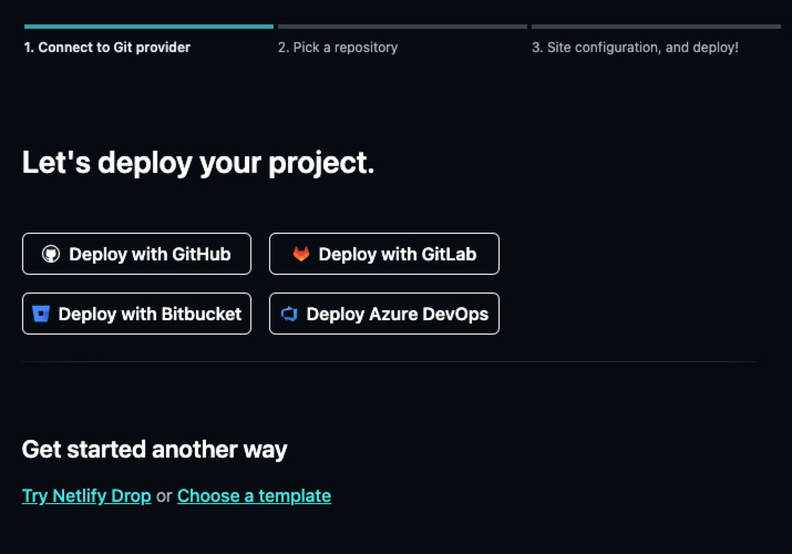
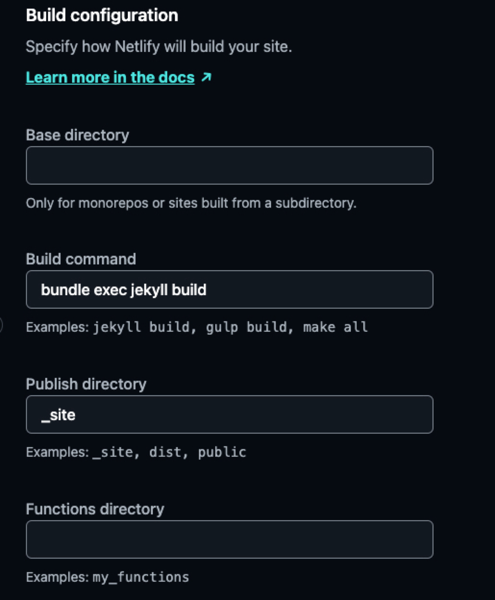
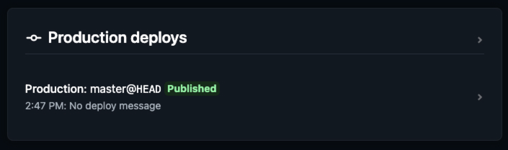
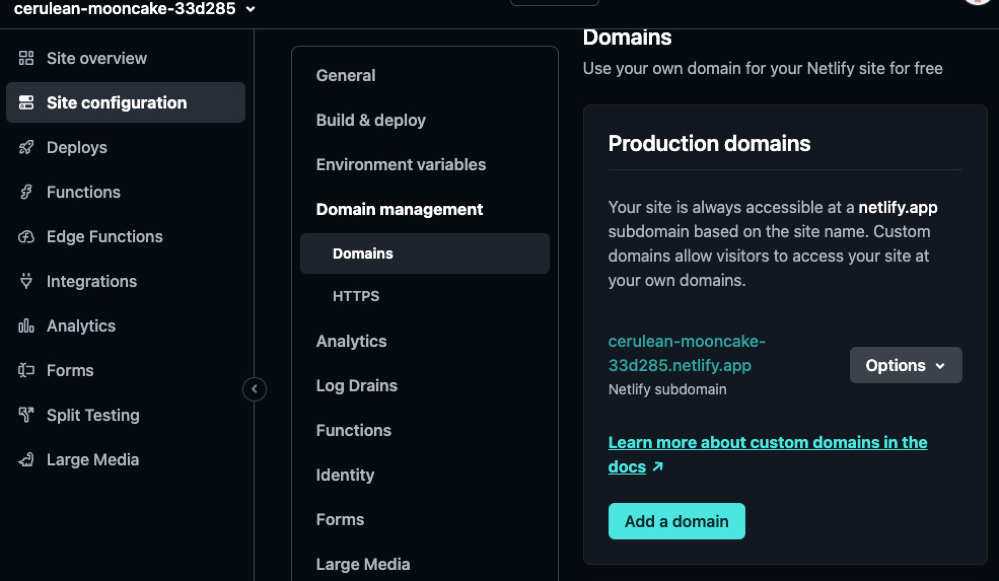
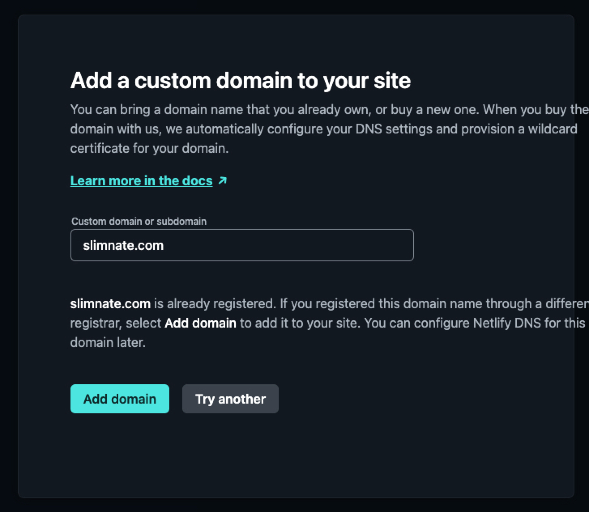
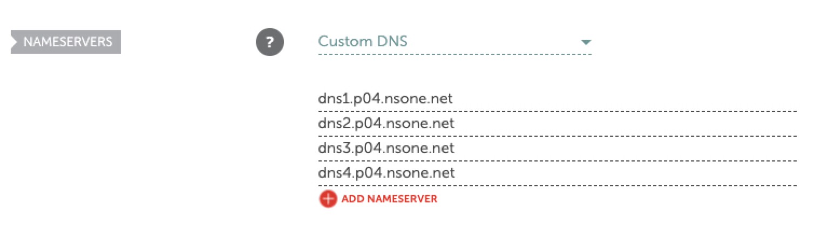
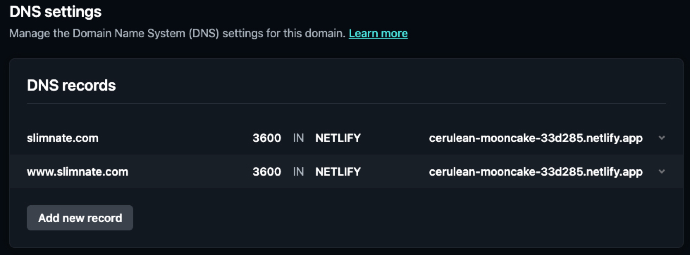

Migrating a static Jekyll blog from Google Cloud Platform to Netlify

1. TOC
{:toc}

# Introduction
At the time of writing this article, this blog was previously hosted with both [Github Pages](https://pages.github.com/), and [Google Cloud Platform (GCP)](https://cloud.google.com/). Now, it's time to move on to the next hosting option, [Netlify](https://www.netlify.com/). If you've read my previous article on hosting the Dream Capture Co photography website, you'll know that I've recently fallen in love with Netlify as a hosting provider for it's ease of use, powerful feature set, and fantastic free tier. Now, I'm ready to migrate my personal blog over from GCP.

## Github pages
The first hosting for the blog was Github Pages, but I switched from that to GCP since I was having trouble with third-party libraries during the automated build process. More about hosting with Github Pages in [this article]()

## GCP
To host this blog on GCP I used a storage bucket to hold all of the site files, and a load-balancer instance to direct my domain name to the storage bucket. I won't get into the details in this article, but it was quite a lot of configuration work to host a simple static generated site. Not to mention the fact that I have been spending about $18 a month just for the HTTP load balancer to direct traffic to a storage bucket...

# Migrating to Netlify
Now it's time to migrate blog hosting to my new favorite cloud hosting provider. I'll walk through this process step by step:

## 1. Create Project
- From the Netlify Console, click on `Add new site` and select `Import an existing project`
- Select `Deploy with GitHub`

- Select the repository for the site from the list
- Ensure that the deployment configuration is correct - Netlify is able to automatically identify that the site is a Jekyll project, and automatically fills out the appropriate configuration fields. If the filed do not auto-populate, ensure that **Build command** is set to `bundle exec jekyll build` and **Publish directory** is set to `_site` (id using default jekyll configuration)

- Click `Deploy blog` to start the first deployment
- Wait for the deployment to complete. You can click on a deployment in the list to see it's details

## 2. Add Domain
After the deployment is finished, it's time to set up the custom domain name.
- Go to `Site configuration`->`Domain Management`, and click on `Add a Domain`

- Enter the custom domain and click `Verify` - if the domain was purchased through another provider, you will have to click `Add domain` and then complete additional steps to update external DNS entries.

## 3. Configure Netlify DNS
I bought my domain from [Namecheap](https://www.namecheap.com/), so I'll have to use the Namecheap dashboard to update my DNS nameservers to point to Netlifys nameservers.

- In the Namecheap console, click `Manage` for the domain name, and select the `DNS` tab.
- Change nameservers option to `Custom DNS`, and add all the nameservers provided by Netlify.

- Verify the DNS entries on Netlify:

## Verify site
Visit both the TLD and any sub-domains configured, and ensure that they load properly.